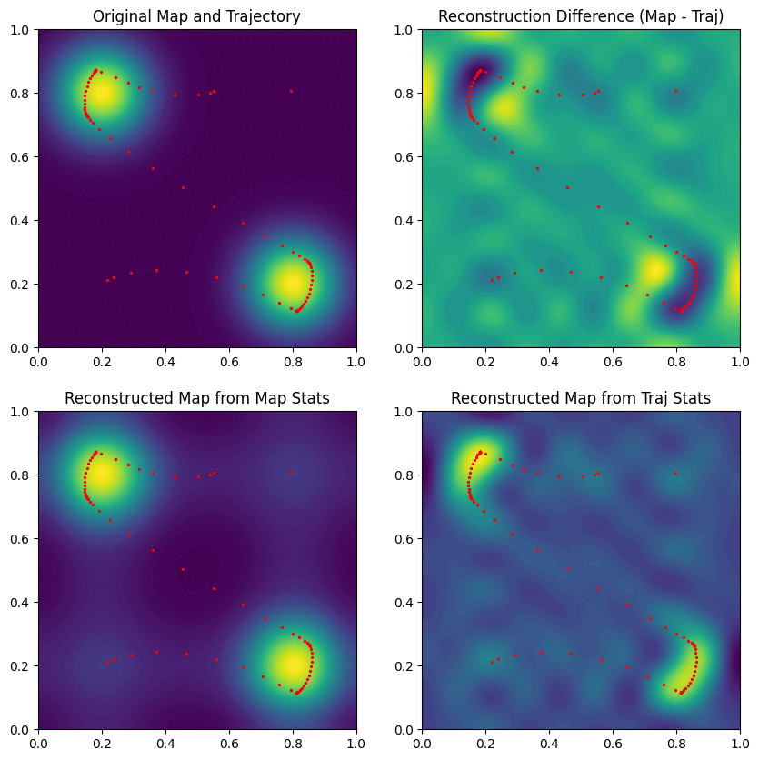

# Ergodic Search

This repository implements basic ergodic search as outlined in [[1]](#1) and modified from MO-ES [[2]](#2).
This optimization strategy learns control parameters (translational and angular velocities) that minimize
the ergodic metric, in addition to other loss components.
In addition to performing trajectory optimization over single maps in a static manner, the planner
class is also capable of handling updates to the map and re-planning based on prior controls. The package 
also allows for external provision of dynamics models for use in the 
optimization step.

## Table of Contents

- [Dependencies](#dependencies)
- [Installation](#installation)
- [Usage](#usage)
    - [Ergodic Planner](#the-ergplanner-class)
    - [Ergodic Loss](#the-ergloss-class)
    - [Examples](#examples)
    - [Custom Dynamics](#incorporating-dynamics-models)
- [Troubleshooting](#troubleshooting-tips)
- [References](#references)

## Dependencies

This implementation is built in Python and relies on PyTorch for optimization. The versions listed
below are the latest versions on which the code has been tested. The code is capable of running on 
a CPU or GPU and was tested on an NVIDIA GeForce RTX 3060 GPU.
- Python == 3.8.10
- PyTorch == 2.0.1+cu118
- argparse == 1.1
- matplotlib == 3.7.1
- numpy == 1.24.3
- functools

## Installation

Once the dependencies have been installed, clone this repository and navigate into it:
```
git clone git@github.com:PlanetaryRobotics/ergodic-search
cd ergodic-search
```

Then the package can be locally installed with ```pip install -e .```

## Usage

This section provides more details on how this repository can be used to perform ergodic search on 
custom maps with various parameter settings. Three example scripts are provided in the top level directory. 

### The ErgPlanner Class

The ergodic planner provided in this repository is contained in the ```ErgPlanner``` class. A set of command line
arguments from ```argparse``` is the only required parameter for initializing the planner. Although this class 
can be initialized without a map, it will require a map to be provided to actually perform ergodic search, which 
can be done with the ```update_pdf``` method. 

#### Class Methods

##### ```__init__```

Initializes the class. This method requires command line arguments provided from the ```ErgArgs``` class via the ```args``` parameter.
Optional arguments are the map (```pdf```), initial controls (```init_controls```), dynamics module (```dyn_model```), and frequency 
information (```fourier_freqs```, ```freq_wts```).

If no initial controls are provided, the controls are initialized to all 0s. If no dynamics module is provided, the differential drive 
dynamics module defined in ```ergodic_search.dynamics``` is used. If no frequency information is provided, the ```num_freqs``` parameter in ```args``` must be > 0.

##### ```update_pdf```

Updates the stored map. This method requires a new map to be provided via the ```pdf``` parameter and does not return any
values. Additional optional parameters are ```fourier_freqs``` and ```freq_wts``` to provide the frequencies and weights to 
use with the new map when computing the ergodic metric. These parameters both default to None.

##### ```update_controls```

Updates the stored controls. This method requires a new set of controls to be provided via the ```new_controls``` parameter and 
does not return any values.

##### ```take_step```

''Takes a step'' in the trajectory by setting the new start point to the first point in the current trajectory and incrementing the controls by one. Final controls are initialized to be the same as the second to last set of controls. This function makes use of the ```update_controls``` function and does not take any parameters nor return any values.

##### ```compute_traj```

Performs the trajectory optimization using ergodic search based on the stored controls, map, and dynamics module. This method
takes one optional argument ```debug``` which is set to False by default and returns the optimized controls, trajectory, and
the final loss metric.

##### ```visualize```

Displays the results from performing ergodic search. The results for the examples shown below are created using this method.
The top left displays the original map, the bottom left displays the map reconstruction from the Fourier basis function terms for the map, the bottom right
displays the map reconstruction from the Fourier basis function terms for the trajectory, and the top right displays the difference between the 
reconstructions (bottom left - bottom right). All maps also display the planned trajectory in red. If steps have been taken, the previous trajectory will be shown in black. This method takes no arguments and 
does not return any values.

The colormap can be changed with the ```cmap``` parameter and defaults to `viridis`. The image is stored if ```args.outpath``` is not none with the name provided with the ```img_name``` parameter (which defaults to `results`).


#### Command Line Arguments

The ```ErgPlanner``` class supports a number of command line arguments that provide flexibility
when using this planner. These arguments are generated by initializing an instance of the ```ErgArgs``` 
class at the beginning of a script and can be modified as desired within a script. The lists below
review the available arguments:

**Search Parameters**

| Parameter | Type | Default | Description |
| ----- | ----- | ----- | ----- |
| ```num_pixels``` | int | 500 | Number of pixels along one side of the map |
| ```traj_steps``` | int | 100 | Number of steps in the trajectory |
| ```start_pose``` | float(3) | [0,0,0] | Starting position (x, y, theta) |
| ```end_pose``` | float(3) | [0,0,0] | Ending position (x, y, theta) |

**Optimization Parameters**

| Parameter | Type | Default | Description |
| ----- | ----- | ----- | ----- |
| ```learn_rate``` | float | 0.001 | Learning rate for optimizer |
| ```iters``` | int | 1000 | Maximum number of iterations for optimization |
| ```epsilon``` | float | 0.005 | Threshold for loss metric (optimization stops if loss is lower than this) |
| ```num_freqs``` | int | 0 | Number of frequencies to use. If 0, expects frequencies to be provided in ```fourier_freqs``` |

The ```learn_rate``` parameter can take up to three arguments to specify learning rate schedulers as desired. With one 
argument, the same learning rate is used throughout optimization. With two arguments, an exponential decay learning rate
scheduler is used to decay the learning rate over time. In this instance, the first argument is the initial learning 
rate and the second is the decay rate. With three arguments, a linear learning rate scheduler is used, with the first argument being the initial learning rate, the second the final learning rate, and the third the number of iterations
over which to apply the linear rate decay.

For the static example discussed [below](#examples), a single learning rate provides the best performance.


**Loss Weights**

| Parameter | Type | Default | Description |
| ----- | ----- | ----- | ----- |
| ```erg_wt``` | float | 1 | Weight on ergodic metric component of loss |
| ```transl_vel_wt``` | float | 0.1 | Weight on translational velocity component of loss |
| ```ang_vel_wt``` | float | 0.05 | Weight on angular velocity component of loss |
| ```bound_wt``` | float | 100 | Weight on boundary component of loss |
| ```end_pose_wt``` | float | 0.5 | Weight on end position component of loss |

_Note_: These weights can be set to 0 to remove any component from consideration when optimizing. The most useful application 
of this property is to remove the need for an end point by setting ```end_pose_wt``` to 0. This will still require provision of an 
end position in the arguments but this end position is ignored and can be safely set to ```[0,0,0]```.

**Flags**

| Parameter | Description |
| ----- | ----- |
| ```gpu``` | Use the GPU instead of CPU |
| ```debug``` | Print loss components for debugging |

**Other Parameters**

| Parameter | Description |
| ----- | ----- |
| ```outpath``` | File path for saving visualizations, defaults to None and displays visuals in a window |


### The ErgLoss Class

The ergodic loss used for trajectory optimization is defined in ```ergodic_search.erg_metric``` and implemented
as the ```ErgLoss``` class. This class is a PyTorch module and implements discrete ergodic metric computations based on 
either the provided frequencies or number of frequencies. In addition, the loss includes components associated with the
trajectory going out of bounds, the end point, and the maximum translational and angular velocities. The full loss function
is
```math
\mathcal{L} = w_{erg}\left(\sum_k \Lambda_k (\phi_k - c_k(\xi))^2 \right) + w_{transl}\frac{\sum v_{transl}^2}{T} + w_{ang} \frac{\sum v_{ang}^2}{T} + w_{end} \sum(\xi_T - end)^2 + w_{bound}\mathcal{L}_{bound}
```

#### Ergodic Metric

The first term in the equation above is the ergodic metric, which computes the difference between Fourier components associated
with the map ($\phi_k$) and the trajectory ($c_k(\xi)$, where $\xi$ is the trajectory). The Fourier components are defined based on a set of frequencies $\omega$ indexed by a 2D index $k$, either provided via ```fourier_freqs``` to the planner and loss classes or set to integers between 0 and ```args.num_freqs```. The $\Lambda$ 
values are weights associated with each frequency, either provided via ```freq_wts``` or defined as $\Lambda_k = \frac{1}{(1+||k||^2)^s}$ where $s = 2$ based on practical performance of the algorithm.

The discrete Fourier components are computed using Fourier basis functions $F_k(\mathbf{x}) = \frac{1}{h_k}cos(\omega_k \pi \mathbf{x}_1)cos(\omega_k \pi \mathbf{x}_2)$ as

$$\phi_k = \sum_X \phi(\mathbf{x})F_k(\mathbf{x})$$

$$c_k = \frac{1}{T} \sum_t F_k(\xi(t))$$

for a set of grid points defined across the map domain. The $h_k$ normalizing factors in the Fourier components are computed as 

$$h_k =  \left(\prod_i \frac{2k_i + \sin (2k_i)}{4k_i}\right)^{1/2}$$

#### Additional Loss Components

The second and third terms compute losses associated with the translational and angular velocities, respectively. Both of these are
defined as the average squared velocity across the set of controls. However, the terms have been separated to allow for application 
of different weights to each terms.

The fourth term computes a loss associated with the final position in the trajectory, which should be close to the desired end position.
This is defined as the squared Euclidean distance between the desired end position and the actual end position.

The final term computes a loss associated with the trajectory passing outside of the bounds of the map. This is set to the distance 
to the boundary for trajectory points outside of the bounds and 0 for points inside the bounds, summed across the entire trajectory. 
The weight on this component is generally set very high compared to the other loss terms to ensure the trajectory remains in the map.

#### Class Methods

##### ```__init__```

Initializes the class based on a set of command line arguments ```args``` and a dynamics module ```dyn_model```. Additional optional
arguments include the map (```pdf```) and the frequency information (```fourier_freqs``` and ```freq_wts```).

##### ```forward```

Computes the loss associated with a set of controls provided via the ```controls``` argument. This involves calling the dynamics
module to produce a trajectory. This trajectory and the controls are then used to compute the full loss, with the components weighted
according to the weights provided in the command line arguments. The full loss is returned. One optional parameter, ```print_flag```, allows printing all of the loss components for each iteration and can be useful for debugging (the ```debug``` command line argument sets this to True).

##### ```calc_erg_metric```

Computes the ergodic metric associated with a set of controls provided via the ```controls``` argument. This involves calling the 
dynamics module to produce a trajectory. The ergodic metric is returned.

##### ```update_pdf```

Updates the stored map. This method requires a new map to be provided via the ```pdf``` parameter and does not return any
values. Additional optional parameters are ```fourier_freqs``` and ```freq_wts``` to provide the frequencies and weights to 
use with the new map when computing the ergodic metric. These parameters both default to None. After the map has been updated, the 
ergodic loss calculations are re-initialized using ```set_up_calcs```.

##### ```set_up_calcs```

Sets up the calculations for the ergodic metric and is called when a map is provided to the class, either via the 
```__init__``` method or via ```update_pdf```. This includes setting up the frequencies, weights, and normalizing factors, as well as 
pre-computing the map statistics and associated reconstruction. The method does not take any parameters and does not return any value.

##### ```ck```

Computes the trajectory statistics for the trajectory provided via the ```traj``` argument. This method returns the trajectory
statistics $c_k$ using the stored frequency information and normalizing factors.

##### ```traj_recon```

Computes a reconstruction of the map from trajectory statistics using the trajectory provided via the ```traj``` argument.
The map reconstruction is returned as a flat array that can be reshaped to the original 2D map using the number of pixels as ```recon.reshape((args.num_pixels, args.num_pixels))```


### Examples

Three example scripts are included in the top-level directory of the repository. Reviewing these scripts can help see how the ```ErgPlanner``` class can be used in practice.

The first script, ```example.py```, provides a simple example of 
ergodic search on a map with two , using the default differential drive dynamics module. Running
```python3 example.py``` should produce the following visualization:


The second script, ```example_map_updates.py```, provides a simple example in which the map is updated several times and the trajectory is re-planned accordingly. This script can be used to see how the map updates work. The results should evolve as shown in the gif below:



The third script, ```example_replanning.py```, provides an example in which the trajectory is re-planned after taking a step and can be used to see how the control updates and ```take_step``` work. The gif below shows the results from this example:


Note that this is a contrived example and does not represent how ergodic search should be used in practice (e.g. the information at each point is not changing as information is gathered). For more information, see [[3]](#3).


### Incorporating Dynamics Models

A differential drive dynamics class (```ergodic_search.dynamics.DiffDrive```) is provided in the code, but user-defined dynamics modules can also be used. These modules should have the following characteristics:

1. Derive from the ```DynModule``` base class defined in ```ergodic_search.dynamics```.
2. Contain a ```forward``` method that uses ```self.controls``` to compute a trajectory. Note that the trajectory __should not__ include the starting position as the first point and should have the same number of steps as the controls.
3. Be differentiable via autodiff or provide an explicit gradient for the trajectory wrt the controls. This means using Pytorch functions like ```torch.cumsum``` instead of for loops to compute the trajectory.

User-defined dynamics modules can be provided to the planner on initialization via the ```dyn_model``` parameter. All examples rely on the included differential drive class.


## Troubleshooting Tips

**The algorithm isn't producing good results when I don't use an endpoint**

You likely need to increase the number of iterations used to optimize the trajectory, potentially paired with a decrease in the learning rate, though we suggest the former as the initial approach.
Using an endpoint provides additional constraints on the potential values the trajectory steps can take, which in practice results in easier optimization of the trajectory.

**My user-defined dynamics module isn't working properly**

PyTorch is likely not computing gradients for the controls correctly. Make sure you are computing the trajectory correctly in the forward method in such a manner that PyTorch can backpropagate the gradients to the controls. Viewing the model graph is a useful way of checking these computations and can be done with, for example, the ```torchviz``` package as follows:

```
from torchviz import make_dot

model = ErgPlanner(...)
dot = make_dot(model(x), params=dict(model.named_parameters()))
dot.render("model_visualization", format="pdf")
```

More information on ```torchviz``` can be found [here](https://github.com/szagoruyko/pytorchviz).

**The controls aren't changing and the ergodic metric isn't decreasing during optimization**

Provide an initial set of controls that isn't all zeros. With an all-zero set of controls, PyTorch cannot compute gradients correctly and will not be able to optimize. The initial set of controls can be as simple as a constant translational velocity with no angular velocity.

## References

<a name="1"></a>[1] G. Mathew and I. Mezić, "Metrics for ergodicity and design of ergodic dynamics for multi-agent systems," Physica D: Nonlinear Phenomena, vol. 240, no. 4-5, pp. 432-442, Feb. 2011, doi: [10.1016/j.physd.2010.10.010](https://www.sciencedirect.com/science/article/pii/S016727891000285X).

<a name="2"></a>[2] Z. Ren et al., "A Local Optimization Framework for Multi-Objective Ergodic Search," Proceedings of Robotics: Science and Systems, New York City, NY, USA, June 2022. Code available in the [rap-lab-org/public_moes](https://github.com/rap-lab-org/public_moes) repository.

<a name="3"></a>[3] L. Dressel and M. Kochenderfer, "On the Optimality of Ergodic Trajectories for Information Gathering Tasks," Proceedings of the 2018 Annual American Control Conference (ACC), Milwaukee, WI, USA, Jun 2018, doi: [10.23919/ACC.2018.8430857](https://ieeexplore.ieee.org/document/8430857/).
